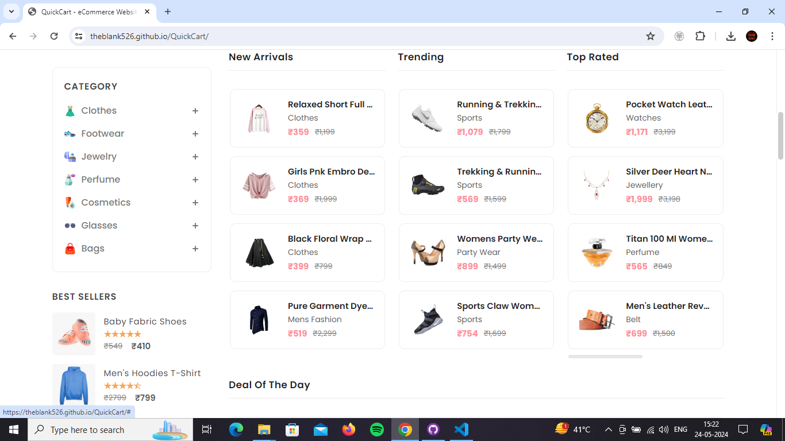

# QuickCart - An eCommerce Website

QuickCart is a fully responsive ecommerce website, maximum compatiblities in all mobile devices, built using HTML, CSS, and JavaScript.


 <a href="https://Theblank526.github.io/QuickCart/"><strong>➥ Live Demo</strong></a>

## Demo

<br>


<br>



<br>


<br>


<br>


<br>


<br>

## Prerequisites

Before you begin, ensure you have met the following requirements:

* [Git](https://git-scm.com/downloads "Download Git") must be installed on your operating system.

## Installing QuickCart

To install **QuickCart**, follow these steps:

Linux and macOS:

```bash
sudo git clone https://github.com/Theblank526/QuickCart.git
```

Windows:

```bash
git clone https://github.com/Theblank526/QuickCart.git
```

## Contact

If you want to contact me you can reach me at [Instagram](https://www.instagram.com/http.arjunsingh?igsh=enZubTlsejVlZ2Vq).

## License

This project is **free to use** and does not contains any license.
